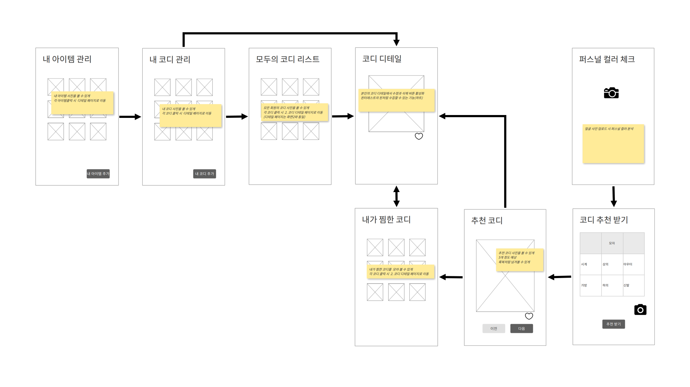

# 쇼체크 탈출

- 목적: 패션에 큰 관심이 없는 20대 남성을 위한 AI 기반의 코디 추천 서비스

- 개발 기간: 20.10.12. ~ 20.11.16.

- [배포 링크](https://k3d205.p.ssafy.io/swagger/)

---

## 목차

- [1. 프로젝트 계획 및 계획서](#프로젝트-계획-및-계획서)

- [2. 팀 구성원 및 업무 분장](#팀-구성원-및-업무-분장)

- [3. 와이어 프레임](#와이어-프레임)
- [4. DB 모델링](#DB-모델링)
- [5. 핵심 기능](#핵심-기능)
- [6. 개발 스택 및 프레임 워크](#개발-스택-및-프레임-워크)
- [7. 느낀점](#느낀점)

---

## 프로젝트 계획 및 계획서

- [계획서.pdf](doc/계획서.pdf)

1. 주요 고객층 선정
   - 패션에 큰 관심이 없는 20대 남성
   - 옷(패션)을 어려워하는 사람.
   - 특정 상황/컨셉에 맞는 옷차림을 입고 싶어한다.
2. 이미지 메이킹(퍼스널컬러) 색상 가중치(유저 정보)를 활용한 코디 추천

3. 일정에 맞는 코디세트 추천
   - 만나는 사람과 상황에 따른 코디 추천
     - 만나는 사람: 혼자 / 친구 / 여사친 / 교수님 등
     - 상황: 학교 / 아르바이트 / PC방 / 발표 및 프레젠테이션 / 결혼식 / 장례식 등
4. 유저의 코디 중 좋아요를 50개 이상 받은 코디는 추천 set에 추가

---

## 팀 구성원 및 업무 분장

**박도희**

- 팀장
- 이미지프로세싱

**조규성**

- 부팀장
- Frontend 전반

**박인영**

- 깃마스터
- 추천 알고리즘 설계

**허성수**

- Backend API 전반
- 이미지 해싱

---

## 와이어 프레임



- [와이어프레임.pdf](doc/와이어프레임.pdf)
- [화면설계.pdf](doc/화면설계.pdf)

---

## DB 모델링


---

## 핵심 기능

**기존의 천편일률적인 코디셋 추천에서 나아가 내가 가진 옷을 바탕으로 각 유저의 퍼스널컬러와 유저의 TPO에 맞추어 코디 추천**

dblib를 사용하여 얼굴 분석 후 퍼스널 컬러 진단(봄웜톤/여름쿨톤/가을웜톤/겨울쿨톤)

OpenCV를 사용해 유저가 올린 이미지의 배경을 지우고 중앙 정렬 및 저장

image hash 기법을 통해 유저가 올린 사진과 DB의 데이터간 유사도 분석 후 추천 모델사용

장소 & 동행의 카테고리를 통해 1차적으로 필터링 후 유사도 분석을 통해 후보군 결정

추천은

상의=>하의, 아우터, 액세서리

하의=>신발

신발=>가방, 시계, 모자

순으로 진행하되, 유저가 올린 아이템이 있을 경우 우선순위를 높인다.

유사도 분석은 유저가 올린 아이템의 세부 카테고리 + 컬러로 아이템 범위를 좁힌 후,

그 안에서 알고리즘을 돌린다.

### 추천 알고리즘 동작 과정

#### 1. 퍼스널 컬러 진단

```markdown
소스코드 참고 ( https://github.com/starbucksdolcelatte/ShowMeTheColor )

OpenCV와 Dlib 라이브러리를 이용하여 사용자의 사진에서 눈동자, 뺨, 눈썹의 영영을 인식하고 각 영역에 대하여 k-means 알고리즘을 통해 대표 색상을 추출 후 HSV S값을 이용해 봄 / 여름 / 가을 / 겨울 중 하나로 진단. 진단 작업은 사용자 사진의 색상과 기준 색상의 차이를 구한 후 피부, 눈썹, 눈동자별로 설정된 가중치를 곱하여 합한 값을 비교. 합이 작은 계절이 질의 사진의 퍼스널컬러 결과로 도출됨
```

#### 2. 스타일 분류

```markdown
사용자가 장소(where)와 동행(who)을 선택하면 각 스타일에 점수를 더함.

가장 점수가 높은 스타일을 first_style, 두번째로 높은 스타일을 second_style로 매겨

아이템 추천 시 스타일이 일치하는지에 따라 first_style은 50점, second_style은 25점을 부여함

## 스타일 분류

- formal (정장 스타일. 격식을 차리는 상황에 추천됨)
- dandy (포멀과 캐주얼 사이의 스타일. 편안하지만 옷차림에 어느정도 신경쓰이는 상황에 추천됨)
- casual (일상적인 옷차림. 캠퍼스룩이나 편안하고 제약이 없는 상황에 추천됨)
- street (현재 패션 트렌드를 반영한 스타일. 포멀을 제외한 나머지 분류와 어우러질 수 있음)
- sporty (운동 또는 활동적인 상황에 추천되는 스타일)

## 장소(where)

- 학교
- 장례식
- 결혼식
- 운동
- 발표
- PC방 / 편한 곳
- 외식

## 동행(who)

- 교수님 (target age 범위를 넓히면 직장 상사도 포함)
- 여사친
- 친구 / 혼자
- 가족
```

#### 3. 계절 분류

```markdown
3~5월 : 봄(spring)
6~8월 : 여름(summer)
9~11월 : 가을(fall)
12~2월 : 겨울(winter)

현재 알고리즘은 위의 네 분류로 나누어 필터링 및 점수 부여(30점)를 하지만,
차후 각 계절 사이에 중간값을 채워 총 여덟 분류로 나누어 현재 기온을 기준으로 추천하도록 알고리즘 세분화 가능
```

#### 4. 이미지 유사도 분석

```markdown
target_item : 유저가 선택한 아이템의 이미지
image_list : DB에서 target_item과 세부 카테고리, 색상이 일치하는 아이템을 뽑은 리스트(array)

image_list를 for문으로 돌며 target_item과 유사도 분석 후 점수를 매겨
가장 점수가 낮은(차이가 없는)순으로 5개를 추출

- 분석 방법 : image hash 기법을 통해 유저가 올린 사진과 DB의 데이터간 유사도 분석
```

#### 5. 퍼스널 컬러 응용

```markdown

```

---

## 개발 스택 및 프레임 워크


---

## 느낀점

**박도희**

- 1
- 2

**조규성**

- 1
- 2

**박인영**

- 1
- 2

**허성수**

- 1
- 2

---
